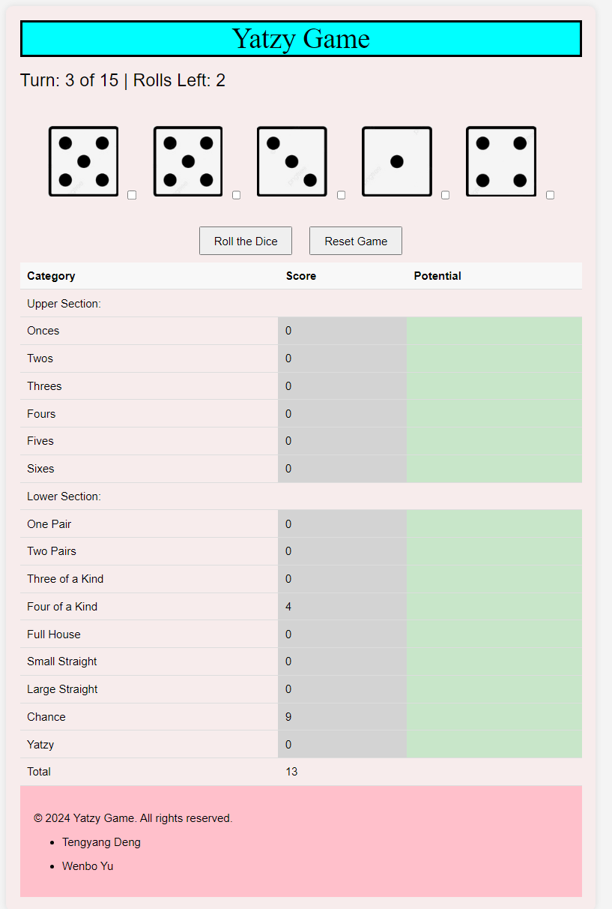

# CSI3140_A2 Yatzy game
### Group25
* Tengyang Deng 300156567
* Wenbo Yu 300161788

## Introduction
This repository documents the design system for my Yatzy game website. This game is a single-player Yatzy game completely in HTML/JS/CSS. The game will enforce the rules of Yatzy, will manage the game state (current score, current role, etc) and will notify the user of the final score when the game is done.

## Usage

Run the test.html for running the code

## Screenshots

## Design System
For more details on the design system used in this project, please refer to the [Design System](/docs/design_system.md).
